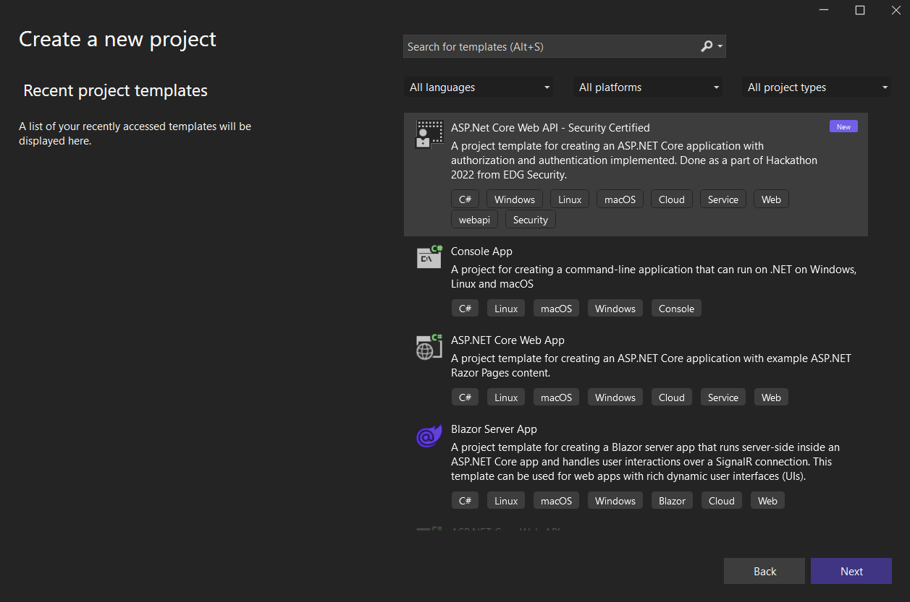

<p align="center">
  <a href="" rel="noopener">
 </a>
</p>
<h3 align="center">Paved Road for Developers:<br>Secure Development Framework</h3>

<div align="center">

  [](https://hackbox.microsoft.com/project/3245) 
  []() 
  [](https://github.com/Jitha-afk/Hackathon22/issues)
  [](https://github.com/Jitha-afk/Hackathon22/pulls)
  [](LICENSE.md)

</div>

---

<p align="center"> Empower developers and their teams to reduce the time to go from idea to value, creating the right environment and removing points of friction for developers to innovate.
    <br> 
</p>

## 📝 Table of Contents
- [📝 Table of Contents](#-table-of-contents)
- [🧐 Problem Statement <a name = "problem_statement"></a>](#-problem-statement-)
- [💡 Idea / Solution <a name = "idea"></a>](#-idea--solution-)
- [⛓️ Dependencies / Limitations <a name = "limitations"></a>](#️-dependencies--limitations-)
- [🚀 Future Scope <a name = "future_scope"></a>](#-future-scope-)
- [🏁 Getting Started <a name = "getting_started"></a>](#-getting-started-)
  - [Prerequisites](#prerequisites)
  - [Installing](#installing)
- [🎈 Usage <a name="usage"></a>](#-usage-)
- [⛏️ Built With <a name = "tech_stack"></a>](#️-built-with-)
- [✍️ Team <a name = "authors"></a>](#️-team-)
- [🎉 Acknowledgments <a name = "acknowledgments"></a>](#-acknowledgments-)

## 🧐 Problem Statement <a name = "problem_statement"></a>
Microsoft distributes software and operating system to billions of customers across the globe. A key contributor to Microsoft’s success is the trust that we have built with our customers by continuously improving the security posture of our products. Developers within Microsoft understand the importance of writing secure code and following continuous Security Development Lifecycle but they spend huge amount of time in keeping their code secure. On top, there are numerous reactive controls from build to post release which validate and flag security gaps. Mitigation of these gaps needs rework and developer bandwidth which is counterproductive. Secure Development Framework (SDF) aims to provide a paved road approach to developers with highly configurable and reusable code libraries / packages / Plugins for various security scenarios. This effort is aimed at providing a Secure Development Framework, which developers can start using right from the Design Phase of SDL.

- IDEAL: Enable all developer teams working on building a product/ application/ tool to adopt this framework in order to avoid common security pitfalls also easing the job.
- REALITY: Various security engagements like AppSec, Threat Modelling, Red/Purple Team engagements have led to findings that are most common amongst developer teams such as:
  - Lack of Authentication (APIs, Function Apps, Internal calls, etc)
  - Incorrect Authentication (No token validation, use of self-signed certs, use of outdated/unverified libraries and protocols, etc)
  - Configuration flaws with an existing solution like MSAL, ADAL.
  - Missing or weak Authorization checks (No claim validation, bad string comparisons, business logic flaws, etc)
- IMPACT:
  - Reduces cognitive load and time for developers to implement security in code allowing them to focus on business logic, solving problems and innovate rather than trying to determine if a vulnerability exists due to different code implementation practices.
  - Reduces load on build and post release validations rather these controls can focus on above baseline vulnerabilities. 
  - Code is secure by birth and stays secure as Born Secure Coding Framework makes continuous improvements.

## 💡 Idea / Solution <a name = "idea"></a>
For the duration of this Hackathon, the team will be focused on delivering:

- - - ### Project template verified and approved by EDGSecurity
        Several predefined project templates are installed with Visual Studio. These templates, such as the ASP.NET Web Application, Console application and Class Library templates, are available to choose from when you create a new project.
        
        The proposal is to create a new template(s) that can be installed as add-ons with visual studio which has authentication implementation in place. First release, will be targeted towards ASP.Net Core Web API, ASP.Net Core Web App which are most frequently used, and authentication and authorization principles are most applicable.

- - - - #### Benefits
        - Easy to use.  
        - The groundwork needed to create a new project template is well tried and tested and also recommended by the Visual Studio team.
        - No worry about maintaining multiple versions. If any NuGets are used in the template, the versioning task falls on the NuGet package owners and not on the templates. Hence easy to maintain.
        - No learning curve for the end user to use.
        - No separate documentation is needed as the code can contain elaborate comments.
        - The same template can have all the recommended authentication mechanisms.

## ⛓️ Dependencies / Limitations <a name = "limitations"></a>

- Currently the template is provisioned for C# .NET Core 6.0 Framework only. (Hack week)

## 🚀 Future Scope <a name = "future_scope"></a>

Items that this project will be able to achieve in the future as not all items could be developed during the course of the Hackathon;

- Support for multiple types of projects (in Visual Studio).
- Support for other languages.
- Additional security areas covered for micro-services on Azure (service fabric or AKS, Defender, telemetry), Trusted cypto modules (Windows, Linux, Mobile), API security services, AutN & AuthZ integration.

## 🏁 Getting Started <a name = "getting_started"></a>
*These instructions will get you a copy of the project up and running on your local machine for development 
and testing purposes.*

### Prerequisites

What things you need to install the software and how to install them.

1. [Microsoft Visual Studio](https://visualstudio.microsoft.com/downloads/)
2. Template from this repo.

### Installing

- Step 1: Clone the repo `git clone https://github.com/Jitha-afk/Hackathon22.git`
- Step 2: Copy the Zip file from `Content` folder and paste it to Project Templates folder.
  - `C:\Users\<user>\Documents\Visual Studio 2022\Templates\ProjectTemplates`
- Select the Project Template `Security Certified` and load it onto your project.



## 🎈 Usage <a name="usage"></a>

Sample `appsettings.json`

```json
{
  "AzureAd": {
    "Instance": "https://login.microsoftonline.com/",
    "Domain": "microsoft.onmicrosoft.com",
    "TenantId": "<My Tenant ID>",
    "ClientId": "<My client ID>",
    "CallbackPath": "/signin-oidc",
    "Scopes": "access_as_user",

    "ValidIssuers": [ "MyValidTenant1", "MyValidTenant2" ],

    "Type": "JWT",

    "IncludeMoreTenants": "false",
    "AdditionalTenants": [ "MyValidTenant1", "MyValidTenant2" ]
  },
  "Logging": {
    "LogLevel": {
      "Default": "Information",
      "Microsoft.AspNetCore": "Warning"
    }
  },
  "AllowedHosts": "*"
}
```

## ⛏️ Built With <a name = "tech_stack"></a>
- [Visual Studio](https://visualstudio.microsoft.com/) - Code Templates

## ✍️ Team <a name = "authors"></a>
    
- [@Abhijit Anurag](https://github.com/abhijitanurag)
- [@Amresh Deochake](https://github.com/amdeocha)
- [@Jitesh Thakur](https://github.com/Jitha-afk)
- [@Kiranmayi Yeddanapudi](https://github.com/kiranmayiyl)
- [@Mohammed Tanveer](https://github.com/threatpointer)
- [@Prasada Rao Meegada](meegada.prasada@microsoft.com)
- [@Rakesh Shukla](shuklarakesh@microsoft.com)
- [@Saurabh Mudgal](https://github.com/smudgal05)
- [@Vivek Mittagunta](https://github.com/vivekmittagunta)

## 🎉 Acknowledgments <a name = "acknowledgments"></a>
- Hat tip to anyone whose code was used
- Inspiration
- References
